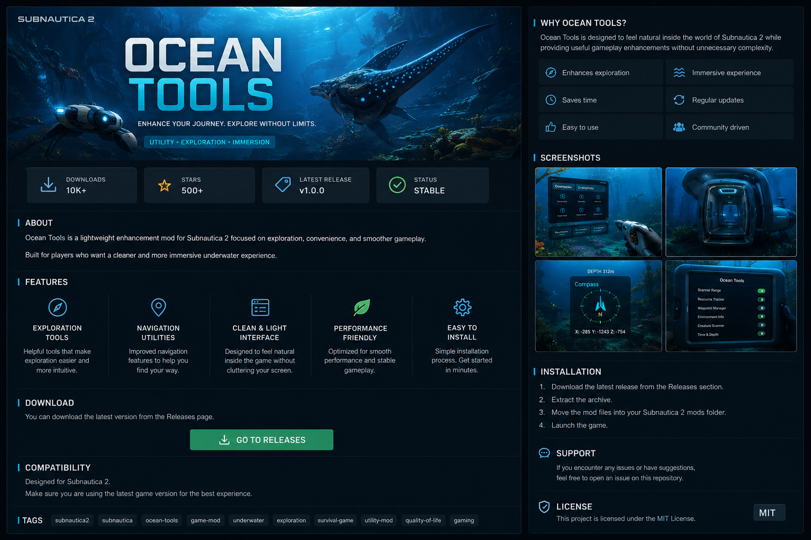

# ocean-tools
Ocean Tools is a lightweight Subnautica 2 enhancement mod focused on exploration, navigation, immersion, and quality-of-life gameplay improvements.

# Ocean Tools

### Enhanced exploration tools for Subnautica 2

  

 

---

# About

Ocean Tools is a lightweight enhancement mod for Subnautica 2 focused on exploration, navigation, immersion, and quality-of-life gameplay improvements.

Designed for players who want a cleaner and more immersive underwater experience.

---

# Features

- Exploration helper tools
- Improved navigation utilities
- Lightweight performance-friendly design
- Clean and immersive interface
- Stable gameplay integration
- Easy installation process
- Optimized for smooth gameplay

---

# Installation

1. Download the latest release from the Releases section.
2. Extract the archive.
3. Move the mod files into your Subnautica 2 mods folder.
4. Launch the game.

---

# Compatibility

- Subnautica 2
- Windows
- Latest game version recommended

---

# SEO Keywords

Subnautica 2 mod, Subnautica 2 tools, exploration mod, underwater utility mod, ocean tools mod, Subnautica helper tools, gameplay enhancement mod, survival game mod, Subnautica utilities, quality of life mod.

---

# License

MIT License
